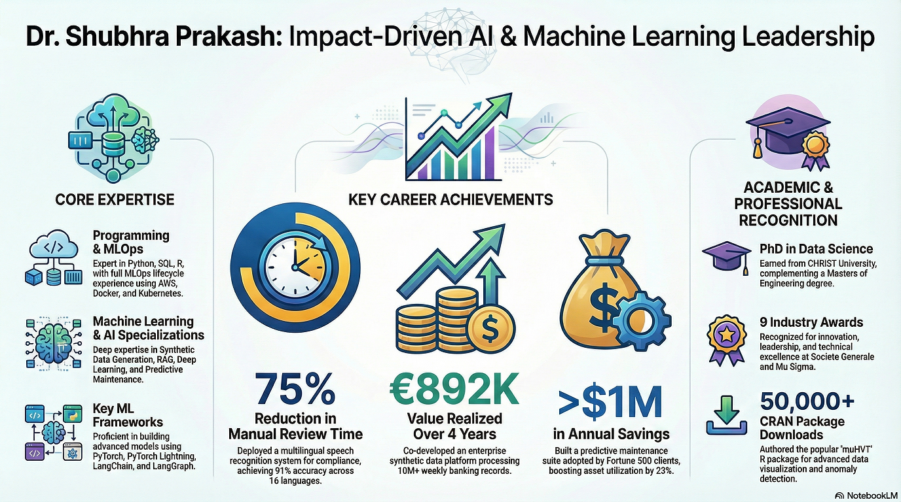

# 👋 Hi, I'm Dr. Shubhra Prakash (@shubhra-opensource)

  

---

## 🎯 About

I am an impact-driven AI and machine learning leader with expertise spanning machine learning, MLOps, and cutting-edge frameworks. With a PhD and multiple industry awards, I have demonstrated exceptional leadership in delivering quantifiable business outcomes, including significant review-time reductions and substantial financial savings. My work extends beyond research to practical applications, with widely-used CRAN packages contributing to the open-source community.

---

## 💼 Focus Areas

- **LLMs & Agentic AI**: Large Language Models and their real-world applications
- **MLOps**: Machine Learning Operations and production deployment
- **Data Science & Machine Learning**: Advanced analytics and predictive modeling
- **Open Source**: Contributing to the community through CRAN packages and collaborative projects

---

## 📚 Publications

### Recent Research

- **Texture-Based DNN for Pneumonia in Thorax X-Rays**  
  *International Research Journal of Multidisciplinary Scope (IRJMS)* · Jul 30, 2025  
  Deep learning-based texture analysis framework for automated pneumonia detection from thoracic X-ray images.

- **Bridging Data Gaps: A Comparative Study of Different Imputation Methods for Numeric Datasets**  
  *IEEE International Conference on Data Science and Network Security (ICDSNS)* · Jul 27, 2024  
  Comprehensive benchmark of classical and modern imputation techniques (Mean, Iterative, kNN, MissForest, Gaussian Copula), showing the superior performance of Gaussian Copula-based imputation across varying missingness levels using Kolmogorov–Smirnov and adversarial validation–based metrics.

- **Exploring the Indian Stock Market through Minimum Spanning Trees and Planar Maximally Filtered Graphs: A Network Analysis Approach**  
  *IEEE Symposium on Systems and Information Engineering Design (SIEDS)* · May 21, 2024  
  Network-based analysis of Nifty-100 stocks using MST and PMFG to uncover structural changes and COVID-19–driven market dynamics via topology-aware metrics.

- **Gray Level Co-occurrence Matrix based Fully Convolutional Neural Network Model for Pneumonia Detection**  
  *International Journal of Electrical and Computer Engineering Systems* · Mar 30, 2024  
  Fully convolutional neural network leveraging GLCM-based texture features for robust pneumonia detection in chest X-rays.

- **Development and Evaluation of Pneumfc Net: A Novel Automated Lightweight Fully Convolutional Neural Network Model for Pneumonia Detection**  
  *Journal of Theoretical and Applied Information Technology* · Feb 15, 2024  
  Design and evaluation of a lightweight FCN architecture (Pneumfc Net) optimized for accurate and efficient pneumonia detection.

- **Comparison of Augmentation and Preprocessing Techniques for Improved Generalization Performance in Deep Learning based Chest X-Ray Classification**  
  *IEEE* · Oct 13, 2022  
  Empirical study of data augmentation and preprocessing strategies to enhance generalization in deep learning models for chest X-ray classification.

- **Detection and Classification of Thoracic Diseases in Medical Images using Artificial Intelligence Techniques: A Systematic Review**  
  *ECS Transactions* · Apr 1, 2022  
  Systematic review of AI-based methods for detection and classification of thoracic diseases in medical imaging, highlighting trends, challenges, and future directions.

### Open Source Packages (CRAN)

- **LMD: A Self-Adaptive Approach for Demodulating Multi-Component Signal**  
  *CRAN* · Sep 20, 2022  
  R package implementing Local Mean Decomposition for adaptive demodulation and analysis of multi-component AM–FM signals, inspired by Smith (2005) and the `PyLMD` library.

- **muHVT: Constructing Hierarchical Voronoi Tessellations and Overlay Heatmap for Data Analysis**  
  *CRAN* · Apr 27, 2022  
  R package for building hierarchical Voronoi tessellations and overlay heatmaps to enable multi-level exploratory data analysis; developed with support from Mu Sigma.

---

## 🤝 Collaboration

I am open to collaborations on open-source packages, applied research, and AI-driven projects.

---

## 📧 Contact

**Email**: shubhra.naukri@gmail.com | shubhraprakash279@gmail.com

---

  <strong>✨ Always curious. Always building. Always learning. ✨</strong>

